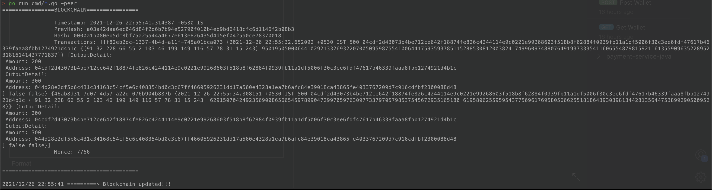

# GOBC

A simple blockchain based crypto currency in go.

Directly jump to the [DEMO](#Demo-and-detailed-instructions)

## Aspects
- [x] Block mining and hashing(SHA256)
- [x] Proof of work with dynamic difficulty
- [x] Distributed p2p blockchain  
- [x] Blockchain update on longest length basis
- [x] Wallets creation with public and private keys
- [x] Transactions signing and verification
- [x] Transaction pool for storing all transactions.
- [ ] Rewards for miners

## Components
### Blocks
Below is the struct to represent single block of a blockchain.
```golang
type Block struct {
	Timestamp    time.Time     `json:"timestamp"`
	PrevHash     string        `json:"prevHash"`
	Hash         string        `json:"hash"`
	Transactions []Transaction `json:"transactions"`
	Nonce        int64         `json:"nonce"`
}
```
- It is a single unit which contains transactions and is mined by miners.
- To mine a block, a miner needs to find a hash which is valid and satisfies the difficulty requirements. This is our `Proof of work`
- Blocks are mined based on a dynamic difficulty(More details in mining section)
- A block is hashed using SHA256 algorithm to keep integrity.
- A block is associated with miner. So, users who just want to transact can make transactions without mining any blocks.

### Blockchain
```golang
type Blockchain struct {
	Blocks []Block
}
```
- A blockchain is a collection of blocks.
- Blockchain contains a genesis block which is the first block in the chain.
- Each block is connected to previous one using `PrevHash` field.

### Transaction
```golang
type Transaction struct {
	Id       uuid.UUID       `json:"id"`
	Input    InputDetail     `json:"input"`
	Output   [2]OutputDetail `json:"output"`
	Verified bool            `json:"verified"`
	Complete bool            `json:"complete"`
}
```
- A transaction is a proof that sender has sent some amount to a receiver.
- Each transaction contains a `Input` field which contains details about senders original balance, senders signature and public key
- Also contains a `Output` field which contains details of [senders balance after transaction + senders public key] and [details of amount received by receiver + recipients public key]
- We use elliptic curve cryptography to sign and verify the transaction, hence we have public key exported.

### Transaction Pool
```golang
type TransactionPool struct {
	Transactions []Transaction `json:"transactions"`
}
```
- A transaction pool is a collection of transactions which are not yet added to blockchain.

### Wallet
```golang
type Wallet struct {
	Balance        int64             `json:"balance"`
	keyPair        *ecdsa.PrivateKey `json:"-"`
	PublicKeyECDSA ecdsa.PublicKey   `json:"-"`
	PublicKey      string            `json:"public_key"`
}
```
- A wallet is associated with a user, it contains balance, private and public key. 
- Private Key is stored using Golang's default mechanism by not exporting it.
- Private key is shown to the user when they first create a wallet.
- Public key is visible to all the users.
- A transaction is signed with private key of wallet/user.
- A transaction is verified with public key of wallet/user.


### Mining
The difficulty is `Dynamic Difficulty` which is calculated based on the `MINE_RATE`. If the time taken to mine a block is less than `MINE_RATE`, the difficulty of the next block will be higher, else vice versa. 

## DEMO and detailed instructions
### 1. Start the p2p server.
- This server handles creation of new wallets.
- This server also keeps track of all transactions in a transaction pool which are made by users with above wallets.
- When a new block is mined, this server is notified.
- It adds all the transactions to the blockchain and broadcasts it to all peers.
- By default, server starts on port 8080. To change it use `-p2pServer-port=<port>` flag.
```shell
$ go run cmd/*go -p2pserver
```


### 2. Create Wallets
- No personal information is needed to create a wallet.
- Send a `POST` request to `localhost:8080/port` to create a wallet.
- In response, a private key is printed. Private key is shown just once, so store it somewhere.
- Remember to create 2 wallets. One for sending and one for receiving. 
- We need senders private key and receivers public key to create a transaction.


### 3. Get receiver wallets public key
- Send a `GET` request to `localhost:8080/wallet` to get the public key of all wallets.
- For, this example we will use the first wallets private key and second wallets public key.
- So, copy the public key of second wallet and store it somewhere.


### 4. Create a transaction.
- Send a `POST` request to `localhost:8080/transactions` to create a transaction.
- Use senders private key and receivers public key to create a transaction.
- By default, is wallet is given `500` coins, so specify amount less than 500.
- Note: You cannot send amount to same wallet.
- Create 5 transaction, so that a transaction pool is created. 
- In each block only 2 transactions can be stored.


### 5. Start the peers to mine blocks.
- Lets start 2 peers
```shell
$ go run cmd/*go -peer
```
- Run the above command in two terminal instances to create 2 peers.
- As soon as the peers start, they mine blocks.
- Once a block is mined, 2 transactions from transaction pool are added to the blockchain.
- Then the new block is broadcasted to all peers.
- New blockchain is only updated if length of incoming blockchain is greater than the peers blockchain.
- Note: Difficulty is dynamic. So if it takes more time to mine a block. In the next block creation, difficulty will decrease.

- In the above picture, after a block is mined, the 2 transactions from transaction pool are added to that block.
- This new blockchain is broadcasted to all peers. And the copy of blockchain at peer is also updated.

- in the above picture, that is the second peer where we can see that the blockchain is updated with remote peer's blockchain after transactions are added to it.
